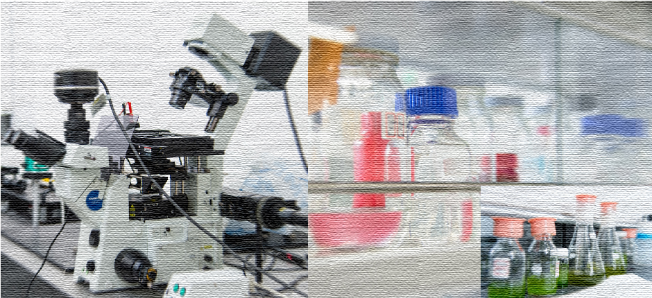

# Yutaka Sumino

{width="80%"}

## Artificial Life Physics

Understanding how life-like behaviors emerge from physical systems.

Artificial Life Physics seeks universal physical principles behind self-organization, pattern formation, and collective dynamics.

Rather than focusing only on molecular components, we investigate general mechanisms underlying emergent dynamics.

Our research focuses on mesoscopic interfaces (100 nm – 1 mm), where transport, mechanics, and geometry interact to generate rich nonequilibrium phenomena.

My recent work aims to bridge active biological systems and non-biological systems through nonlinear dynamics and stochastic coarse-grained models.

## Research interests

- Artificial Life Physics
- Mesoscopic interfaces with active flows
- Collective motion in biological and synthetic systems
- Reduced models and Langevin descriptions
- Nonlinear dynamics and pattern formation

## External profiles for publications and research activities

- [Google Scholar](https://scholar.google.com/citations?user=PYPm4uYAAAAJ&hl=en&oi=ao)
- [researchmap](https://researchmap.jp/7000001301?lang=en)
- [ORCID](https://orcid.org/0000-0002-0724-7650)
- [GitHub](https://github.com/ysumino)
- [Sumino Lab website](http://www.rs.tus.ac.jp/sumino_lab/)