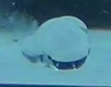
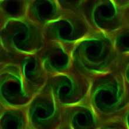

## Active Motion of Mesoscopic Interfaces

{width="50%"}

I study active motion of mesoscopic interfaces such as droplets, vesicles, and colloids driven by chemical reactions and interfacial flows.

---

## Active Turbulence in Biological Systems

{width="60%"}

My work explores active flows and pattern formation in biological and biomimetic systems, including cytoskeletal active matter and confined geometries.

---

## Reduced Models and Stochastic Dynamics

I develop reduced mathematical descriptions, including effective stochastic equations, to extract essential dynamical principles from complex systems.